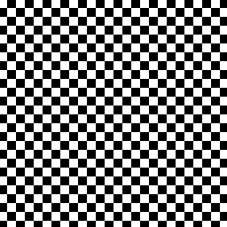

# HardCoords
HardCoords is a small library that uses Pillow to generate images using functions.  
Learning lambda functions before using HardCoords can be hard.

## Table
Use Table from hardcoords to do program art.
```py
from hardcoords import *
table = Table(dimensions(1024,1024))
```
#### .ring(center=(0,0),btw=(0,500),gob=(1,1))
Inserts ring-shaped function to table.

#### .line(pos1=(-512,-512),pos2=(512,512),weight=20)
Inserts line-shaped function to table.

#### .main_ring()
Returns the ring-shaped function

#### .main_line()
Returns the line-shaped function

## Examples
### Ex A
```py
from hardcoords import *
table = Table(dimensions=(256,256))
table.insert(lambda x,y: x%2!=y%2)
table.show()
table.save("1.png")
```

### Ex B
```py
from hardcoords import *
table = Table(dimensions=(256,256))
table.insert(lambda x,y: (x//10)%2!=(y//10)%2)
table.show()
table.save("2.png")
```

### Ex C
```py
from hardcoords import *
table = Table(dimensions=(256,256))
table.insert(lambda x,y: table.main_line((30,30),(30,60),5)(abs(x),y))
table.insert(lambda x,y: table.main_ring((0,-20),(40,50))(x,y) and (y < -20))
table.ring(btw=(100,120))
table.show()
table.save("3.png")
```

